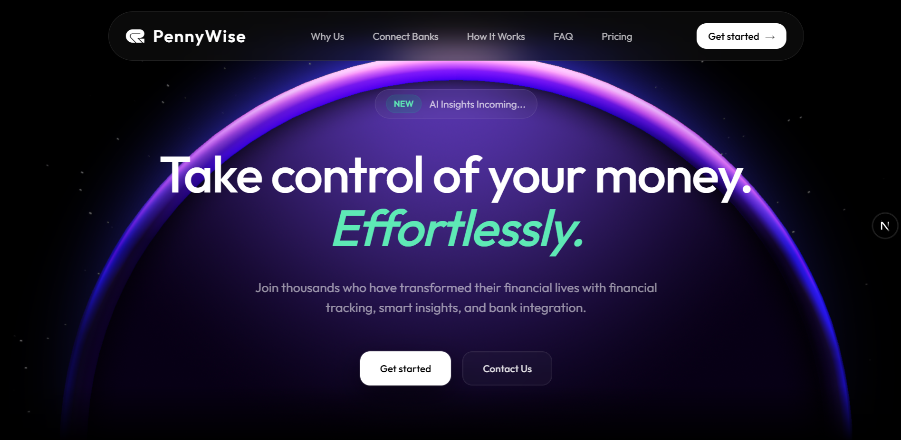

# 💰 PennyWise

A modern, feature-rich personal finance management application built with Next.js, designed to help you track expenses, manage accounts, and gain insights into your financial habits.



## ✨ Features

### 🏦 **Account Management**
- Create and manage multiple accounts
- Track balances across different accounts
- Real-time balance updates

### 📊 **Transaction Tracking**
- Add, edit, and delete transactions
- Categorize transactions for better organization
- Support for income and expense tracking
- Bulk transaction import via CSV

### 🏷️ **Smart Categories**
- Customizable expense categories
- Visual category management
- Transaction categorization for better insights

### 📈 **Financial Analytics**
- Interactive charts and graphs
- Spending trends and patterns
- Monthly/yearly reports
- Visual financial summaries

### 🎨 **Modern UI/UX**
- Beautiful, responsive design
- Dark/light theme support
- Mobile-friendly interface
- Smooth animations and transitions

### 🔐 **Secure Authentication**
- User registration and login
- Secure session management
- Protected routes and data

## 🛠️ Tech Stack

- **Frontend**: Next.js 16, React 19, TypeScript
- **Styling**: Tailwind CSS, Radix UI
- **Database**: Neon (PostgreSQL) with Drizzle ORM
- **Authentication**: Clerk
- **State Management**: Zustand, TanStack Query
- **Charts**: Recharts
- **Icons**: Lucide React
- **Backend**: Hono for API routes

## 🚀 Getting Started

### Prerequisites

- Node.js 18+ 
- npm, yarn, pnpm, or bun

### Installation

1. **Clone the repository**
   ```bash
   git clone https://github.com/yourusername/penny-wise.git
   cd penny-wise
   ```

2. **Install dependencies**
   ```bash
   npm install
   # or
   yarn install
   # or
   pnpm install
   # or
   bun install
   ```

3. **Set up environment variables**
   ```bash
   cp .env.example .env.local
   ```
   
   Configure your environment variables:
   ```env
   # Clerk Authentication
   NEXT_PUBLIC_CLERK_PUBLISHABLE_KEY=
   CLERK_SECRET_KEY=
   
   # Database
   DATABASE_URL=
   
   # Other configurations...
   ```

4. **Set up the database**
   ```bash
   npm run db:generate
   npm run db:migrate
   ```

5. **Run the development server**
   ```bash
   npm run dev
   # or
   yarn dev
   # or
   pnpm dev
   # or
   bun dev
   ```

6. **Open your browser**
   
   Navigate to [http://localhost:3000](http://localhost:3000) to see the application.

## 📁 Project Structure

```
penny-wise/
├── app/                    # Next.js app router
│   ├── (auth)/            # Authentication pages
│   ├── dashboard/         # Main dashboard
│   └── api/               # API routes
├── components/            # Reusable components
│   ├── ui/               # Base UI components
│   └── landing/          # Landing page components
├── features/             # Feature-specific code
│   ├── accounts/         # Account management
│   ├── categories/       # Category management
│   ├── transactions/     # Transaction handling
│   └── summary/          # Analytics and reports
├── hooks/                # Custom React hooks
├── lib/                  # Utility functions
├── db/                   # Database schema and config
└── public/               # Static assets
```

## 🎯 Available Scripts

- `npm run dev` - Start development server
- `npm run build` - Build for production
- `npm run start` - Start production server
- `npm run lint` - Run ESLint
- `npm run db:generate` - Generate database migrations
- `npm run db:migrate` - Run database migrations
- `npm run db:studio` - Open Drizzle Studio

## 🌟 Key Features in Action

### Dashboard Overview
- Real-time balance tracking
- Recent transactions
- Spending insights
- Quick action buttons

### Transaction Management
- Intuitive transaction forms
- Smart categorization
- Bulk import capabilities
- Advanced filtering and search

### Analytics & Reporting
- Interactive spending charts
- Category-wise breakdowns
- Trend analysis
- Export capabilities
